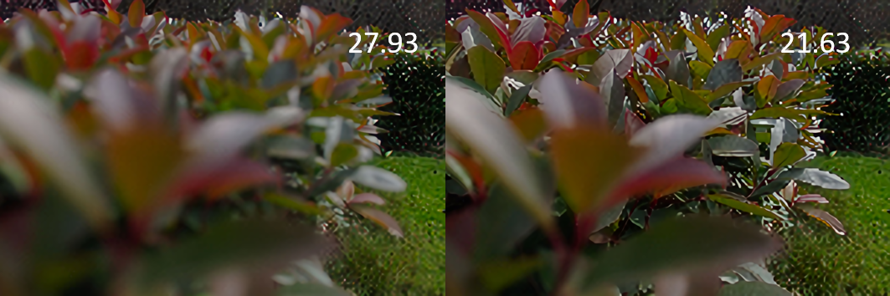

# Deep-Weighted-Guided-Upsampling-Network-for-Depth-of-Field-Image-Upsampling

The official implementation of paper "Deep Weighted Guided Upsampling Network for Depth of Field Image Upsampling". This paper has been published in ACMMM Asia 2022. You can download the paper from the [link](https://dl.acm.org/doi/10.1145/3551626.3564940)

## Supplementary Material

### Qualitative Comparisons with SOTA methods

<center>Results of DWGUN with various focuses. From the top to the bottom row are the ground truths, our results, and the results of TTSR, respectively. </center>

More Comparisons:

<table>
    <tr>
        <td><center>Ground Truth</center></td>
        <td><center>DWGUN</center></td>
        <td><center>SRNTT</center></td>
        <td><center>TTSR</center></td>
    </tr>
</table>

### Other Qualitative Comparisons

<table>
    <tr>
        <td><center>Ground Truth </center></td>
    </tr>
    <tr>
        <td><center>DWGUN </center></td>
    </tr>
    <tr>
        <td><center>Bilinear </center></td>
    </tr>
    <tr>
        <td><center>DGU </center></td>
    </tr>
    <tr>
        <td><center>DRNS </center></td>
    </tr>
    <tr>
        <td><center>GGU </center></td>
    </tr>
    <tr>
        <td><center>GIU </center></td>
    </tr>
    <tr>
        <td><center>JBU </center></td>
    </tr>
    <tr>
        <td><center>WGU </center></td>
    </tr>
</table>

### Additional Quantitative Results

#### Ablation Study

|       Method       | Transpose\\ Conv | Feature\\ Recover | Softmax\\ (RRM) |  Type   | 612$\times$408$\to$1224$\times$816 |                | 306$\times$204$\to$1224$\times$816 |                | 153$\times$102$\to$1224$\times$816 |                |
| :----------------: | :--------------: | :---------------: | :-------------: | :-----: | :--------------------------------: | :------------: | :--------------------------------: | :------------: | :--------------------------------: | :------------: |
|                    |                  |                   |                 |         |             PSNR (dB)              |   SSIM (\%)    |             PSNR (dB)              |   SSIM (\%)    |             PSNR (dB)              |   SSIM (\%)    |
| DWGUN\\ NoDecoder  |                  |                   |                 | Shallow |               21.31                |     87.55      |               18.20                |     78.21      |               17.26                |     74.71      |
|                    |                  |                   |                 |  Deep   |               19.57                |     82.04      |               16.43                |     69.33      |               15.45                |     64.71      |
| DWGUN\\ NoRecover  |    \checkmark    |                   |   \checkmark    | Shallow |               46.79                |     99.44      |               46.26                |     98.98      |               39.38                |     97.88      |
|                    |                  |                   |                 |  Deep   |               44.90                |     99.49      |               40.88                |     98.93      |               37.49                |     97.61      |
|    DWGUN\\ Conv    |                  |    \checkmark     |   \checkmark    | Shallow |               47.61                |     99.42      |               44.74                |     98.96      |               40.81                |     97.83      |
|                    |                  |                   |                 |  Deep   |               46.99                |     99.49      |               43.65                |     99.03      |               40.25                |     97.94      |
| Simple\\ TransConv |    \checkmark    |    \checkmark     |                 | Shallow |               38.04                |     98.13      |               32.67                |     94.68      |               28.82                |     89.69      |
|                    |                  |                   |                 |  Deep   |               33.46                |     95.93      |               28.65                |     88.18      |               25.13                |     79.48      |
|       DWGUN        |    \checkmark    |    \checkmark     |   \checkmark    | Shallow |               48.44                | \textbf{99.45} |               45.39                | \textbf{99.05} |               41.69                | \textbf{98.07} |
|                    |                  |                   |                 |  Deep   |               48.71                | \textbf{99.57} |               45.55                | \textbf{99.24} |               41.57                | \textbf{98.29} |

#### Acceleration of DoF Rendering

|       Method        | 1024$\times$1024 (original) |          |        | 512$\times$512 (2$\times$) |          |        | 256$\times$256 (4$\times$) |          |        | 128$\times$128 (8$\times$) |          |        |
| :-----------------: | :-------------------------: | :------: | :----: | :------------------------: | :------: | :----: | :------------------------: | :------: | :----: | :------------------------: | :------: | :----: |
|                     |           render            | upsample | total  |           render           | upsample | total  |           render           | upsample | total  |           render           | upsample | total  |
| shift-and-add (CPU) |            29.99            |    0     | 29.99  |            9.95            |  14.66   | 24.61  |            3.58            |  18.54   | 22.12  |            1.10            |  19.46   | 20.56  |
|     PyNet (CPU)     |            86.72            |    0     | 86.72  |           23.13            |  14.66   | 37.79  |            6.08            |  18.54   | 24.62  |            1.63            |  19.46   | 21.09  |
|     PyNet (GPU)     |           0.2577            |    0     | 0.2577 |           0.1445           |   0.01   | 0.1545 |           0.1084           |   0.03   | 0.1384 |           0.0951           |   0.04   | 0.1351 |

## Environment introduction

### Hardware

```command
CPU: Intel(R) Core(TM) i7-8700K
GPU: GTX 1080
RAM: 8G*2 2666
```

### Python

```command
torchvision==0.7.0+cu101
torch==1.6.0+cu101
opencv_python==4.4.0.46
numpy==1.18.5
scikit_image==0.18.1
Pillow==8.1.1
skimage==0.0
```

## Dataset

Several image pairs in dataset are shown below:

<table>
    <tr>
        <td><center>Input (GT) in Training Dataset</center></td>
        <td><center>Guidance (GT) in Training Dataset</center></td>
    </tr>
</table>

<table>
    <tr>
        <td><center>Input (GT) in Testing Dataset </center></td>
        <td><center>Guidance (GT) in Testing Dataset </center></td>
    </tr>
</table>

<table>
    <tr>
        <td><center>Input (GT) in Additional Dataset </center></td>
        <td><center>Guidance (GT) in Additional Dataset </center></td>
    </tr>
</table>

[Baidu](https://pan.baidu.com/s/1Ap6fUxGO0OcIXTmDjPmOWg?pwd=4ca5), code: 4ca5

[Google](https://drive.google.com/file/d/1z6ZD4L3Sx6vaOLbGg6yE3HWALYhjt7zp/view?usp=sharing)

## Model

The pretrained model is already uploaded in repo, `./model/DWGUN.pth`

## Training

Customize the `trainConfig` in `train.py` and run it

```python
python train.py
```

## Testing

Customize the `evalPngConfig` in `test.py` and run it

```python
python test.py
```

In `test.py`, you can use `testAllInOne` to test x2/x4/x8 for both shallow & deep testing dataset at one time. Or use `evalPng` to test the selected scale.

## Other

If you have any question, please leave an issue.

## Citation

```bitex
@inproceedings{10.1145/3551626.3564940,
author = {Zeng, Lanling and Wu, Lianxiong and Yang, Yang and Shen, Xiangjun and Zhan, Yongzhao},
title = {Deep Weighted Guided Upsampling Network for Depth of Field Image Upsampling},
year = {2022},
isbn = {9781450394789},
publisher = {Association for Computing Machinery},
address = {New York, NY, USA},
url = {https://doi.org/10.1145/3551626.3564940},
doi = {10.1145/3551626.3564940},
abstract = {Depth-of-field (DoF) rendering is an important technique in computational photography that simulates the human visual attention system. Existing DoF rendering methods usually suffer from a high computational cost. The task of DoF rendering can be accelerated by guided upsampling methods. However, the state-of-the-art guided upsampling methods fail to distinguish the focus and defocus areas, resulting in unsatisfying DoF effects. In this paper, we propose a novel deep weighted guided upsampling network (DWGUN) based on a encoder and decoder framework to jointly upsample the low-resolution DoF image under the guidance of the corresponding high-resolution all-in-focus image. Due to the intuitive weight design, the traditional weighted image upsampling is not tailored to DoF image upsampling. We propose a deep refocus-defocus edge-aware module (DREAM) to learn the spatially-varying weights and embed them in the deep weighted guided upsampling block (DWGUB). We have conducted comprehensive experiments to evaluate the proposed method. Rigorous ablation studies are also conducted to validate the rationality of the proposed components.},
booktitle = {Proceedings of the 4th ACM International Conference on Multimedia in Asia},
articleno = {18},
numpages = {7},
keywords = {image upsampling, deep learning, graphics, computational photography},
location = {Tokyo, Japan},
series = {MMAsia '22}
}
```
